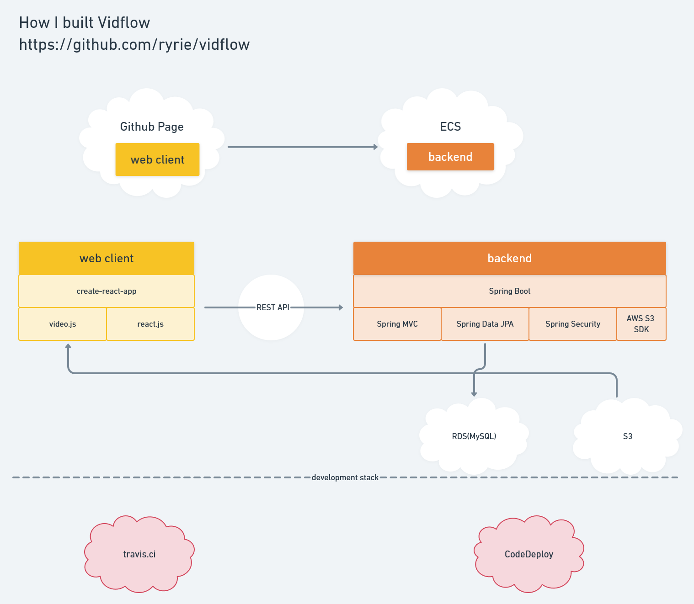

# Vidflow 

[Tiktok](https://www.tiktok.com)을 모티브로 한 mobile web application 입니다.

저의 개발 공부의 목적으로만 사용됩니다. 

### 사용한 프레임워크/라이브러리

Frontend : react.js [저장소 바로가기](https://github.com/ryrie/vidflow-web)

Backend : Spring Boot

https://whimsical.com/8GuyXPfT9u4WDGciFb2tZU

### 프로젝트 관련 문서

[문서 바로가기](docs/Index.adoc)

